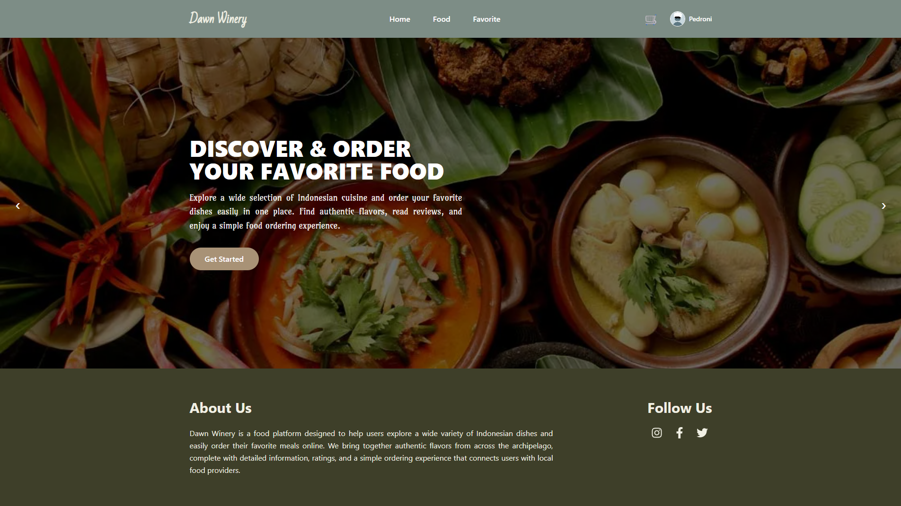

# 🍷 Final Project – Dawn Winery

## 📌 Deskripsi Project

Dawn Winery merupakan aplikasi web berbasis **React.js (Next.js)** yang terintegrasi dengan **API dari Bootcamp Dibimbing**.
Aplikasi ini dikembangkan sebagai **Final Project Bootcamp Front End Developer** dengan fokus pada implementasi autentikasi, integrasi API, pengelolaan state menggunakan React Hooks, serta penerapan role-based access control.

Aplikasi ini memiliki dua role utama yaitu **User** dan **Admin**, di mana masing-masing memiliki hak akses yang berbeda.
User dapat melihat makanan, menyimpan makanan ke favorite, melakukan transaksi, serta mengelola profil mereka. Sementara itu, Admin memiliki akses untuk mengelola data makanan dan transaksi yang terjadi di dalam sistem.

Aplikasi juga menerapkan **protected route**, **data fetching dari API**, serta **responsive design** sehingga dapat digunakan dengan baik pada perangkat desktop maupun mobile.

---

# 🚀 Live Demo

https://final-project-pedroni-gilbran-fe-25.vercel.app/

---

# 📸 Application Preview



---

# 🚀 Tech Stack & Library

### Framework & Styling

* React.js (**Next.js – Pages Router**)
* **TypeScript**
* **Tailwind CSS**

### Additional Libraries

```bash
npm install react-icons
npm install sonner
npm install react-toastify
```

### API

* Bootcamp Dibimbing API

---

# 🔐 Fitur Utama

Aplikasi memiliki dua role utama: **User** dan **Admin**.

## 👤 User Features

* Register dan Login user
* Protected route (halaman tertentu hanya dapat diakses setelah login)
* Melihat daftar makanan
* Menyimpan makanan ke **favorite**
* Menambahkan makanan ke **cart berdasarkan quantity**
* Memilih **payment method**
* **Upload bukti pembayaran**
* Melihat **history transaksi berdasarkan status**

  * Pending
  * Success
  * Cancelled
  * Failed
* Update **profile user**

---

## 🛠️ Admin Features

* CRUD (Create, Read, Update, Delete) **Food**
* **Manajemen transaksi**
* **Manajemen role user**

---

# 📱 UI / UX

* Responsive design
* Mendukung **desktop dan mobile**

---

# 🌐 API Endpoint

## Authentication

* POST Register User
* POST Login User
* GET Logout User

## Like

* POST Like Food
* POST Unlike Food

## Food

* GET Get All Foods
* GET Get User Liked Foods
* GET Get Food By Id
* POST Create New Foods
* POST Update Food By Id
* DELETE Delete Food

## User

* GET Get User Login
* GET Get All User
* POST Update Profile
* POST Update User Role

## Rating

* POST Create Food Rating
* GET Get Rating by Food Id

## Payment Method

* GET Payment Methods
* POST Generate Payment Methods

## Cart

* POST Add to Cart
* POST Update Cart
* DELETE Delete Cart
* GET Get Carts

## Transaction

* GET Transaction By Id
* GET My Transactions
* GET All Transactions
* POST Create Transaction
* POST Cancel Transaction
* POST Update Transaction Proof Payment
* POST Update Transaction Status

## Upload Image

* POST Upload Image

---

# 👤 Akun Testing

Pengguna dapat membuat akun sendiri melalui fitur **Register** pada aplikasi untuk mencoba seluruh fitur yang tersedia.
